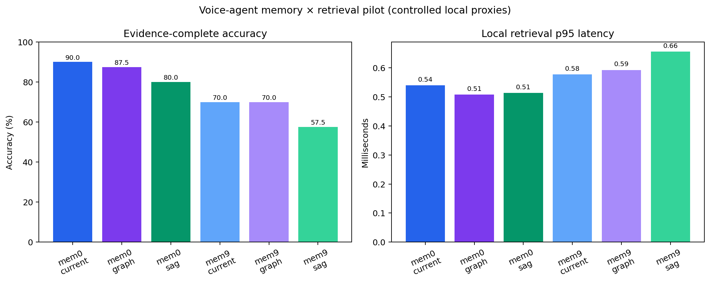

# Voice-Agent Memory × Retrieval Pilot

**Date:** 2026-07-24  
**Source:** `test_agent.service_78.log` plus controlled, product-shaped memory probes  
**Status:** Reproducible local proxy experiment; not an official Mem0 or mem9 product benchmark

## Executive summary

I converted a real company voice-agent service log into 205 canonical semantic
events (128 user-side and 77 teammate-side), then inserted 21 controlled memory
and game-knowledge probes. The final benchmark contains 226 events and 40
evidence-labeled queries across direct recall, aliases, scope, temporal updates,
multi-hop reasoning, game knowledge, mixed memory/knowledge, and abstention.

The strongest configuration was the **selective, consolidated memory policy
with the current scoped RAG retriever**, reaching **90.0% evidence-complete
accuracy** (bootstrap 95% CI: **80.0%–97.5%**) and **91.3% Recall@3**.

The main result is not that a particular advanced retriever won. It is that
**memory quality had a larger effect than retrieval complexity**:

- Selective/consolidated memory improved accuracy over event-preserving memory
  by **17.5–22.5 percentage points**, depending on the retriever. All three
  paired bootstrap confidence intervals excluded zero.
- Graph retrieval did not significantly beat the current retriever in this
  small, single-session benchmark.
- The SAG proxy improved structural and temporal ranking in some cases, but
  over-activated entity neighborhoods and performed poorly on abstention.
- Explicit `user_id` / `game_id` / `teammate_id` filtering produced **0% scope
  leakage** in all six configurations.

**Recommended product decision:** keep the current PostgreSQL/pgvector-style
retrieval as the near-term baseline. Prioritize durable-memory extraction,
update consolidation, abstention, and strict scope filtering before investing
heavily in GraphRAG or SAG.

## What was evaluated

The experiment varies two independent factors:

| Factor | Level | Controlled behavior |
|---|---|---|
| Memory policy | `mem0_style` | Select durable facts, canonicalize them, and keep the latest value for each slot |
| Memory policy | `mem9_style` | Preserve meaningful utterance events with lightweight near-duplicate removal |
| Retrieval | `current_rag` | Character n-gram semantic search plus metadata filters |
| Retrieval | `graph_rag` | Semantic search plus entity overlap and connected-memory boosting |
| Retrieval | `sag` | Deterministic scope/event activation plus semantic, entity, and temporal fusion |

These are **local architectural proxies**. The workspace did not contain Mem0
or mem9 credentials, SDKs, endpoints, or local servers, so the report must not
be presented as a hosted-vendor comparison.

## Dataset

### Real log

The parser extracted:

| Item | Count |
|---|---:|
| Parsed service lines | 3,226 |
| Canonical semantic events | 205 |
| User-side events | 128 |
| Teammate-side events | 77 |
| Real duration represented | about 25 minutes |
| Manually identified durable real memories | 1 |

Duplicate raw/final ASR lines, audio-byte telemetry, WebSocket events, flush
operations, and TTS status lines were excluded from the semantic corpus.

The real durable preference was based on variants of:

> “能别叫我主人吗？” / “你不许叫我主人。”

The log also supplies realistic background noise: partial sentences, ASR name
variants, Chinese-English-Japanese mixing, in-game state, repeated utterances,
and transient tactical chatter.

### Controlled probes

The experiment inserts 17 durable memories and four game-knowledge records,
including:

- Global preferences: language, response length, anti-trash-talk policy
- Game scope: ARAM role and Twisted Fate build
- Teammate-game scope: COD with Bill versus Valorant with Bill
- Teammate preferences: encouragement and forms of address
- Temporal updates: output role → tank; AP build → attack-speed AD
- Multi-hop coordination: Kaiwen uses sniper; Bill covers close range
- Game knowledge: Yasuo crit, Twisted Fate yellow card, ARAM snowball, Thresh lantern

The controlled facts are interleaved with the real log timeline instead of
being evaluated in a clean synthetic conversation.

### Query distribution

There are 40 queries, including five required-abstention cases. Every query has
gold evidence slots and expected current values. Multi-hop questions can
require two evidence records.

## Aggregate results

| Memory policy | Retriever | Evidence-complete accuracy | 95% CI | Recall@3 | MRR | Stale-hit rate | Local p95 |
|---|---|---:|---:|---:|---:|---:|---:|
| Selective/consolidated | Current RAG | **90.0%** | 80.0–97.5% | **91.3%** | 85.0% | **0.0%** | ~0.54 ms |
| Selective/consolidated | GraphRAG | 87.5% | 75.0–97.5% | 88.8% | **85.4%** | **0.0%** | ~0.51 ms |
| Selective/consolidated | SAG | 80.0% | 67.5–92.5% | 80.0% | 76.3% | **0.0%** | ~0.51 ms |
| Event-preserving | Current RAG | 70.0% | 55.0–82.5% | 71.3% | 70.0% | 12.5% | ~0.58 ms |
| Event-preserving | GraphRAG | 70.0% | 55.0–82.5% | 71.3% | 70.0% | 7.5% | ~0.59 ms |
| Event-preserving | SAG | 57.5% | 42.5–72.5% | 57.5% | 55.8% | **5.0%** | ~0.66 ms |

Local latency is useful only for relative code-path comparison. It excludes
network calls, production databases, embedding APIs, LLM inference, and TTS.



## Paired comparisons

Using the same 40 queries for every configuration:

| Comparison | Accuracy delta | Bootstrap 95% CI | Interpretation |
|---|---:|---:|---|
| Selective vs event-preserving under Current RAG | **+20.0 pp** | +7.5 to +35.0 | Clear pilot advantage |
| Selective vs event-preserving under GraphRAG | **+17.5 pp** | +7.5 to +30.0 | Clear pilot advantage |
| Selective vs event-preserving under SAG | **+22.5 pp** | +7.5 to +37.5 | Clear pilot advantage |
| GraphRAG vs Current RAG under selective memory | −2.5 pp | −12.5 to +5.0 | No demonstrated improvement |
| SAG vs Current RAG under selective memory | −10.0 pp | −22.5 to 0.0 | No demonstrated improvement |

The confidence intervals quantify sampling uncertainty over this query set.
They do not account for model-version uncertainty or the difference between
the local proxies and real Mem0/mem9 services.

## Memory-state quality

The selective policy materialized 16 current durable memory records, while the
event-preserving policy retained 179 memory records. Both retained the same
four game-knowledge records.

| Policy | Current-state precision | Current-state recall | Memory records | Contamination |
|---|---:|---:|---:|---:|
| Selective/consolidated | 100.0% | 100.0% | 16 | 0.0% |
| Event-preserving | 8.9% | 100.0% | 179 | 91.1% |

Here “precision” means that a materialized memory record matches a gold current
slot/value. Temporary game utterances and obsolete values count as
contamination. This definition intentionally rewards a clean current state.

The result is partly structural: the two local policies were designed to
represent selective fact memory versus event preservation. It demonstrates
the cost of indiscriminate persistence, not an official claim that mem9 stores
all utterances or that Mem0 extracts perfectly.

## Failure analysis

### Current RAG

With selective memory it failed four of 40 queries:

- One language query used a semantic paraphrase that the local character
  n-gram representation could not bridge.
- One multi-hop query needed both the sniper role and Bill’s close-range
  responsibility.
- One noisy alias query used `豆小包` and indirect language.
- One abstention query about Biwen’s favorite food matched an unrelated Biwen
  preference.

This suggests the current pipeline mainly needs a stronger embedding model,
calibrated abstention, and explicit multi-evidence expansion—not necessarily a
complete retrieval rewrite.

### GraphRAG

Graph retrieval recovered the difficult Bill multi-hop query, but the overall
accuracy did not improve. Entity boosting also displaced useful semantic
results on noisy or mixed queries.

This is a common graph failure mode: an entity connection shows that a memory
is *related*, not that it answers the requested relation. Production GraphRAG
needs relation-type constraints, not only entity co-occurrence.

### SAG

SAG preserved fresh values and reduced stale hits in the event-preserving
corpus, but it failed abstention. Once an entity such as `毕文` or `Alice`
activated a local neighborhood, the proxy could return a structurally related
memory even when the requested predicate—such as favorite food—was absent.

The next SAG iteration should activate on:

```text
(entity match) AND (predicate/intent compatibility) AND (scope match)
```

not merely:

```text
(entity match) AND (scope match)
```

## What this teaches about evaluation engineering

### 1. Separate lifecycle from retrieval

A memory system decides what to write, merge, supersede, expire, and delete. A
retriever decides what evidence to return for a query. If both change at once,
an accuracy difference cannot be attributed to either cause.

This experiment uses a factorial design:

```text
2 memory policies × 3 retrieval strategies = 6 configurations
```

That lets us estimate memory-policy effects, retrieval effects, and their
interaction.

### 2. Evaluate evidence before answers

Final-answer accuracy mixes together:

1. memory extraction,
2. retrieval,
3. prompt construction,
4. LLM reasoning.

The benchmark scores retrieved evidence slots first. Only after evidence
quality is stable should an answer-generation model be added.

### 3. Use paired tests

Every system answers the same 40 questions. Therefore the useful statistic is
the per-query paired difference, not the difference between two unrelated
averages. Paired bootstrap intervals reveal that the memory-policy effect is
visible in this pilot, while the GraphRAG effect is not.

### 4. Abstention is a first-class metric

Retrieving plausible but unsupported personal information is often worse than
saying “I don’t know.” Entity and graph systems are especially vulnerable
because relatedness can be mistaken for evidence.

### 5. Benchmark validity has layers

- **Internal validity:** Did we isolate the variable being tested?
- **Construct validity:** Does “evidence complete” represent useful memory?
- **External validity:** Will results generalize beyond one session?
- **Operational validity:** Do latency and cost resemble production?

This pilot has reasonable internal validity for the local proxies, but limited
external and operational validity.

## Limitations

1. Mem0 and mem9 are represented by local architectural proxies.
2. Retrieval uses character n-gram TF-IDF rather than the production embedding model.
3. GraphRAG and SAG are intentionally small reference implementations.
4. The real data covers one approximately 25-minute session and one main user identity.
5. Most gold memories and queries are controlled additions.
6. Forty queries produce wide confidence intervals.
7. Local sub-millisecond latency does not predict hosted-service latency.
8. No final response LLM was evaluated; “accuracy” means evidence completeness.

## Recommended next steps

### Immediate product work

1. Keep SQL metadata filters as mandatory gates.
2. Add a durable-memory classifier with explicit `should_store` and `expires_at`.
3. Consolidate memories by `(user, scope, game, teammate, slot)`.
4. Add calibrated no-evidence/abstention behavior.
5. Log retrieved memory IDs, scores, filters, and latency for every real request.

### Real Mem0/mem9 experiment

Implement two adapters with this contract:

```python
class MemorySystem:
    def reset(self, namespace: str) -> None: ...
    def ingest(self, events: list[dict]) -> None: ...
    def export_memories(self) -> list[dict]: ...
```

Then replace `mem0_style` and `mem9_style` while keeping:

- `canonical_events.jsonl`
- `benchmark_queries.jsonl`
- the three retrievers
- metrics and bootstrap procedure

Run both:

1. **Stock end-to-end:** each product’s normal write and search behavior.
2. **Controlled retrieval:** export normalized memories and run the same three
   retrievers over each product-authored corpus.

### Data collection

Before making a product decision, target:

- 20+ genuine sessions
- 5+ users
- multiple teammates per user
- at least two games
- explicit preference updates across days
- 200+ manually checked queries

## Mentor-ready conclusion

> We built a reproducible pilot from one real voice-agent session, augmented
> with controlled product-specific memory probes. Across 40 evidence-labeled
> queries, selective and consolidated memory improved retrieval accuracy by
> 17.5–22.5 percentage points across all retrieval strategies. The existing
> scoped RAG baseline achieved the best overall result at 90%, while GraphRAG
> did not show a statistically supported aggregate improvement and the SAG
> proxy over-retrieved on no-answer questions. The current evidence suggests
> prioritizing memory lifecycle quality, update consolidation, scope filters,
> and abstention before adopting a more complex retrieval architecture. These
> are local proxy results; real Mem0/mem9 API adapters and multi-session data
> are required before making vendor claims.

